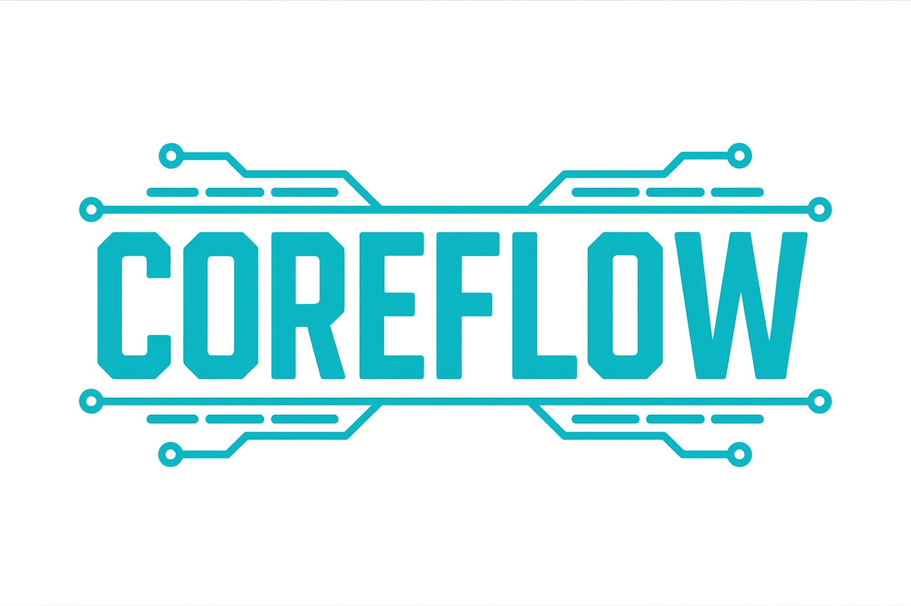

<div align="center">
  
</div>

# Python SDK

[](https://github.com/CKFXLab/coreflow-sdk/.github/workflows/ci.yml)
[](https://opensource.org/licenses/MIT)
[](https://www.python.org/downloads/)

A comprehensive Python SDK for building AI-powered applications with support for multiple LLM providers, RAG systems, memory management, and web search capabilities. COREFLOW SDK eliminates hardcoded dependencies and enables runtime model switching through factory patterns and intelligent credential detection.

## 🚀 Features

- **🤖 Multi-Model Support**: OpenAI, Anthropic, AWS Bedrock providers with automatic selection
- **🧠 Memory Management**: Persistent conversation memory with Mem0 integration
- **📚 RAG System**: Vector storage and retrieval with Qdrant
- **🔍 Web Search**: Real-time web search and scraping capabilities
- **🏗️ Workflow Factory**: Flexible workflow creation and customization
- **🤖 Multi-Agent Coordination**: Coordinate multiple AI agents with different roles and specializations
- **🔧 Method Overrides**: Customize workflow behavior with ease
- **🛠️ Custom Workflow Extensions**: Extend workflows with custom logic and coordination patterns
- **🌐 FastAPI Integration**: Production-ready API endpoints
- **⚙️ Environment Management**: Node.js-style dotenv configuration
- **🔐 Credential Awareness**: Automatic credential detection and graceful degradation
- **🎯 Auto Model Selection**: Intelligent model selection based on available credentials
- **🔄 Dynamic Model Switching**: Switch between models at runtime without code changes
- **🏭 Factory Pattern Architecture**: Clean separation between workflow logic and model implementations
- **🔌 Pluggable Components**: Easily extend with new models and workflow types
- **📦 Minimal Dependencies**: Lightweight core with optional extensions
- **🚀 Performance Optimized**: Designed for production AI/ML workloads

## 📋 Prerequisites

### Required Dependencies
- **Docker** (required for OpenMemory)
- **OpenAI API Key** (required for LLM interactions and OpenMemory)
- **Python 3.8+**

### Setting up OpenMemory

For more detailed instructions and advanced installation see [OpenMemory Github](https://github.com/mem0ai/mem0/blob/main/openmemory/README.md)

COREFLOW SDK uses OpenMemory (mem0ai) for memory management functionality. You need to set up OpenMemory before using the SDK:

#### Quick Setup

You can quickly run OpenMemory by running the following command:

```bash
curl -sL https://raw.githubusercontent.com/mem0ai/mem0/main/openmemory/run.sh | bash
```

You should set the `OPENAI_API_KEY` as a global environment variable:

```bash
export OPENAI_API_KEY=your_api_key
```

You can also set the `OPENAI_API_KEY` as a parameter to the script:

```bash
curl -sL https://raw.githubusercontent.com/mem0ai/mem0/main/openmemory/run.sh | OPENAI_API_KEY=your_api_key bash
```

#### Development Setup (Alternative)

For development or custom configurations:

**Prerequisites:**
- Docker and Docker Compose
- Python 3.9+ (for backend development)
- Node.js (for frontend development)
- OpenAI API Key

**Setup:**
1. Clone and configure OpenMemory:
   ```bash
   git clone https://github.com/mem0ai/mem0.git
   cd mem0
   cp api/.env.example api/.env
   # Edit api/.env and set OPENAI_API_KEY=your_api_key
   ```

2. Follow OpenMemory's setup instructions in their repository.

#### Alternative: AWS Bedrock Configuration

**Note:** COREFLOW SDK has alternative configuration for OpenMemory to use AWS Bedrock models over OpenAI, but it is recomended to use the OPENAI_API_KEY for intitial setup of OpenMemory locally:

```bash
# Set AWS credentials instead of OpenAI
export AWS_ACCESS_KEY_ID=your_aws_access_key
export AWS_SECRET_ACCESS_KEY=your_aws_secret_key
export AWS_REGION=us-east-1

# Configure OpenMemory to use Bedrock
export MEM0_PROVIDER=bedrock
export MEM0_MODEL=anthropic.claude-3-haiku-20240307-v1:0
```

#### Verifying OpenMemory Installation

After setting up OpenMemory, verify it's running correctly:

```bash
# Check if Docker containers are running
docker ps

# Test OpenMemory API (adjust port if different)
curl http://localhost:8000/health

# Check logs if there are issues
docker logs <container_name>
```

## 📦 Installation

### Install from GitHub

```bash
# Install latest from master branch
pip install git+https://github.com/CKFXLab/coreflow-sdk.git

# Install a specific version/tag
pip install git+https://github.com/CKFXLab/coreflow-sdk.git@v0.1.0

# Install in development mode (if you've cloned the repo)
git clone https://github.com/CKFXLab/coreflow-sdk.git
cd coreflow-sdk
pip install -e .
```

### Development Installation

For development with all optional dependencies:

```bash
git clone https://github.com/CKFXLab/coreflow-sdk.git
cd coreflow-sdk
pip install -e .[dev]

# Install optional dependencies for file processing
pip install PyPDF2 python-docx openpyxl beautifulsoup4 python-magic
```

## 🚀 Quick Start

**⚠️ Important:** Make sure OpenMemory is running before using COREFLOW SDK (see Prerequisites section above).

### 1. Set up Environment Variables

Create a `.env.development` file:

```bash
# Required: At least one model provider (choose one or more)
OPENAI_API_KEY=your_openai_key          # Recommended - Highest priority
# AWS_ACCESS_KEY_ID=your_aws_key        # Alternative for Bedrock (Alternate AWS Methods available)
# AWS_SECRET_ACCESS_KEY=your_aws_secret

# Optional: Additional features
ANTHROPIC_API_KEY=your_anthropic_key    # Alternative
SERPER_API_KEY=your_serper_key          # Enables web search
MEM0_API_KEY=your_mem0_key              # Enables cloud memory
HF_TOKEN=your_huggingface_token         # Enables HuggingFace models

# Environment
NODE_ENV=development
```

**⚠️ Important**: You need at least one model provider credential (OpenAI, Anthropic, or AWS) for the system to work. Other credentials are optional and enable additional features.

### 2. Basic Usage with Automatic Credential Detection

```python
from coreflow_sdk import WorkflowFactory, ModelRegistry
from coreflow_sdk.workflow import create_workflow, single_agent_config

# Create a workflow with automatic credential detection
workflow = create_workflow(single_agent_config(
    # No model_config needed - automatically selects best available model
    enable_memory=True,
    enable_rag=True,
    enable_websearch=True  # Will be disabled if SERPER_API_KEY missing
))

# Check what's available
status = workflow.get_component_status()
print(f"Model: {status['model_client']}")
print(f"Web search: {status['search_client']}")

# Generate a response
response = workflow.generate_response(
    query="What is machine learning?",
    user_id="user123"
)
print(response)
```

### 3. Manual Model Configuration

```python
from coreflow_sdk import WorkflowFactory, ModelRegistry
from coreflow_sdk.model.utils import gpt4o_mini_config

# Register models with the factory
registry = ModelRegistry()
registry.register("openai", OpenAIModel)
registry.register("anthropic", AnthropicModel)

# Create workflow with specific model
factory = WorkflowFactory(registry)
workflow = factory.create_workflow(
    workflow_type="single_agent",
    model_config=gpt4o_mini_config(),
    enable_memory=True,
    enable_rag=True
)

# Execute workflow
result = workflow.run(input_data="Your prompt here")
```

## 🏗️ Workflow Configuration

### Available Workflow Types

```python
from coreflow_sdk.workflow import get_available_workflow_types

# Get available workflow types
available_types = get_available_workflow_types()
print("Available workflow types:")
for workflow_type, info in available_types.items():
    print(f"  - {workflow_type}: {info['class_name']} (available: {info['available']})")
```

### Single Agent Workflow

```python
from coreflow_sdk.workflow import create_workflow, single_agent_config
from coreflow_sdk.model.utils import claude3_haiku_config

workflow = create_workflow(single_agent_config(
    model_config=claude3_haiku_config(),
    enable_memory=True,
    enable_rag=True,
    enable_websearch=True
))
```

### Multi-Agent Workflow

```python
from coreflow_sdk.workflow import multi_agent_config
from coreflow_sdk.model.utils import gpt4o_mini_config, claude3_haiku_config

# Define multiple agents with different roles and specializations
agents = [
    {
        "role": "researcher",
        "model_config": gpt4o_mini_config(),
        "specialization": "web_search_and_analysis",
        "tools": ["web_search", "rag"]
    },
    {
        "role": "writer", 
        "model_config": claude3_haiku_config(),
        "specialization": "content_generation",
        "tools": ["memory", "rag"]
    },
    {
        "role": "reviewer",
        "model_config": gpt4o_mini_config(), 
        "specialization": "quality_control",
        "tools": ["memory"]
    }
]

# Create multi-agent configuration
config = multi_agent_config(
    agents=agents,
    coordination_strategy="sequential",  # researcher -> writer -> reviewer
    enable_memory=True,
    enable_rag=True,
    max_iterations=3
)

# Create workflow (configuration ready - implementation available)
workflow = create_workflow(config)
```

### API-Enhanced Workflow

```python
from coreflow_sdk.workflow import api_enhanced_config
from coreflow_sdk.model.utils import gpt4o_mini_config

# Define external APIs that the workflow can call
external_apis = [
    {
        "name": "weather_api",
        "url": "https://api.openweathermap.org/data/2.5/weather",
        "type": "rest_api",
        "method": "GET",
        "headers": {"Content-Type": "application/json"},
        "auth_type": "api_key",
        "auth_header": "X-API-Key"
    },
    {
        "name": "stock_api", 
        "url": "https://api.polygon.io/v1/open-close",
        "type": "rest_api",
        "method": "GET",
        "timeout": 15
    },
    {
        "name": "database_api",
        "url": "https://my-company-api.com/graphql",
        "type": "graphql_api",
        "headers": {"Authorization": "Bearer {token}"}
    }
]

# Create API-enhanced configuration
config = api_enhanced_config(
    external_apis=external_apis,
    model_config=gpt4o_mini_config(),
    enable_function_calling=True,
    api_timeout=30,
    max_api_calls_per_query=5
)

# Create workflow (configuration ready - implementation available)
workflow = create_workflow(config)
```

### Custom Workflow Extensions

```python
from coreflow_sdk.workflow import CustomWorkflow, create_workflow, single_agent_config

class MultiAgentCoordinator(CustomWorkflow):
    """Example of custom multi-agent coordination."""
    
    def __init__(self, base_workflow, agents=None):
        super().__init__(base_workflow)
        self.agents = agents or []
    
    def generate_response(self, query: str, user_id: str = "default_user", **kwargs) -> str:
        """Override to coordinate multiple agents."""
        if len(self.agents) <= 1:
            return super().generate_response(query, user_id, **kwargs)
        
        # Multi-agent coordination
        agent_responses = []
        for i, agent in enumerate(self.agents):
            agent_response = agent['workflow'].generate_response(query, user_id, **kwargs)
            agent_responses.append({
                "agent": agent.get('role', f'agent_{i+1}'),
                "response": agent_response
            })
        
        # Coordinate responses
        coordinated_response = self._coordinate_responses(agent_responses, query)
        return self.process_response(coordinated_response, query, user_id)

# Create multiple agent workflows
researcher_workflow = create_workflow(single_agent_config(enable_websearch=True))
writer_workflow = create_workflow(single_agent_config(enable_memory=True))

# Create multi-agent coordinator
agents = [
    {"role": "researcher", "workflow": researcher_workflow},
    {"role": "writer", "workflow": writer_workflow}
]

base_workflow = create_workflow(single_agent_config())
multi_agent = MultiAgentCoordinator(base_workflow, agents)
```

### Method Overrides

```python
def custom_query_processor(workflow_instance, query: str, user_id: str) -> str:
    # Add custom preprocessing
    enhanced_query = f"[PRIORITY] {query}"
    return workflow_instance.super_method("process_query", enhanced_query, user_id)

workflow = create_workflow(single_agent_config(
    method_overrides={
        "process_query": custom_query_processor
    }
))
```

## 🎯 Model Providers

### OpenAI

```python
from coreflow_sdk.model.utils import gpt4o_mini_config, gpt4o_config

# GPT-4o Mini (recommended for development)
config = gpt4o_mini_config()

# GPT-4o (for production)
config = gpt4o_config()
```

### Anthropic

```python
from coreflow_sdk.model.utils import claude3_haiku_config, claude3_sonnet_config

# Claude 3 Haiku (fast and cost-effective)
config = claude3_haiku_config()

# Claude 3 Sonnet (balanced performance)
config = claude3_sonnet_config()
```

### AWS Bedrock

```python
from coreflow_sdk.model.utils import bedrock_config

# Claude 3 on Bedrock
config = bedrock_config("anthropic.claude-3-haiku-20240307-v1:0")

# Titan on Bedrock
config = bedrock_config("amazon.titan-text-express-v1")
```

## 📚 RAG System

### Store Documents

```python
from coreflow_sdk.vector import RAG

rag = RAG(collection_name="my_documents")

# Store text
rag.store(
    text="Machine learning is a subset of AI...",
    metadata={"topic": "ML", "source": "textbook"},
    user_id="user123"
)

# Process file
rag.process_file(
    filepath="document.pdf",
    collection_type="user",
    user_id="user123"
)
```

### Search Documents

```python
results = rag.search_similar(
    query="What is machine learning?",
    user_id="user123",
    limit=5
)

for result in results:
    print(f"Score: {result['score']}")
    print(f"Text: {result['text']}")
    print(f"Metadata: {result['metadata']}")
```

## 🧠 Memory Management

```python
from coreflow_sdk.vector import Mem0

memory = Mem0()

# Add memory
memory.add(
    text="User prefers technical explanations",
    user_id="user123"
)

# Search memory
memories = memory.search(
    query="user preferences",
    user_id="user123"
)

# Get all memories
all_memories = memory.get_all(user_id="user123")
```

## 🔍 Web Search

```python
from coreflow_sdk.websearch import Search, Scrape

search = Search()
scrape = Scrape()

# Search the web
results = search.search("latest AI developments")

# Scrape webpage
content = scrape.scrape("https://example.com")
```

## 🌐 FastAPI Integration

```python
from fastapi import FastAPI
from coreflow_sdk.workflow import BaseWorkflow
from coreflow_sdk.model.utils import gpt4o_mini_config

app = FastAPI(title="COREFLOW API")

# Initialize workflow
workflow = BaseWorkflow(
    model_config=gpt4o_mini_config(),
    enable_memory=True,
    enable_rag=True,
    enable_websearch=True
)

@app.post("/chat")
async def chat_endpoint(request: dict):
    response = workflow.generate_response(
        query=request["query"],
        user_id=request.get("user_id", "default_user")
    )
    return {"response": response}
```

### Available Endpoints

The SDK provides production-ready FastAPI endpoints:

See [FastAPI Reference](.github/docs/API_REFERENCE.md)

#### Chat Endpoints
- `POST /chat` - Process chat queries
- `POST /chat/stream` - Streaming responses

#### RAG Endpoints
- `GET /rag/collections` - List collections
- `POST /rag/collections/{name}/store` - Store documents
- `POST /rag/collections/{name}/upload` - Upload files
- `GET /rag/collections/{name}/search` - Search documents

#### Model Endpoints
- `GET /models` - List available models
- `GET /models/{name}` - Get model details
- `POST /models/{name}/healthcheck` - Health check

#### Health Endpoints
- `GET /health` - Basic health check
- `GET /health/detailed` - Comprehensive status
- `GET /health/components` - Component health

## ⚙️ Environment Configuration

The SDK supports Node.js-style environment configuration with **credential awareness**:

### File Structure

```
project-root/
├── .env.development       # Development settings
├── .env.production       # Production settings
├── .env.test            # Test settings
├── .env.local           # Local overrides (gitignored)
└── .env.example         # Example file
```

### Loading Order (Highest to Lowest Precedence)

1. System Environment Variables
2. `.env.local`
3. `.env.[environment].local`
4. `.env.[environment]`

### Credential Detection and Validation

```python
from coreflow_sdk.utils.env import ENV

env = ENV()
print("Environment:", env.get_environment())

# Check available credentials
credentials = env.get_available_credentials()
print(f"OpenAI available: {credentials['openai_api_key']}")
print(f"Web search available: {credentials['serper_api_key']}")

# Check disabled features
disabled = env.get_disabled_features()
print(f"Disabled features: {disabled}")

# Get best available model
model_config = env.get_best_available_model_config()
print(f"Selected model: {model_config['provider']}:{model_config['model']}")
```

### Deployment Scenarios

#### Local Development
```bash
# .env.development
NODE_ENV=development
EMBEDDING_PROVIDER=openai
QDRANT_HOST=localhost
QDRANT_USE_DOCKER=true
```

#### Production Cloud
```bash
# .env.production
NODE_ENV=production
EMBEDDING_PROVIDER=bedrock
QDRANT_URL=https://your-cluster.qdrant.tech
QDRANT_API_KEY=your_api_key
AWS_REGION=us-east-1
```

#### AWS Fargate
```bash
# .env.production
NODE_ENV=production
EMBEDDING_PROVIDER=bedrock
QDRANT_URL=http://qdrant-service.namespace.svc.cluster.local:6333
QDRANT_DEPLOYMENT_MODE=fargate
```

## 📊 Monitoring and Health

### Component Status

```python
from coreflow_sdk.workflow import BaseWorkflow

workflow = BaseWorkflow()

# Get component status
status = workflow.get_component_status()
print("Model client:", status["model_client"])
print("Memory client:", status["memory_client"])
print("Vector client:", status["vector_client"])

# Validate workflow
validation = workflow.validate_workflow()
print("Valid:", validation["valid"])
print("Errors:", validation["errors"])
print("Warnings:", validation["warnings"])
```

### Health Check Endpoint

```bash
curl http://localhost:8000/health/detailed
```

## 🔧 Troubleshooting

### Common OpenMemory Issues

**"Connection refused" or "OpenMemory not found" errors:**
- Ensure OpenMemory is running: `docker ps` should show mem0ai containers
- Check that OpenMemory is accessible on the expected port (usually localhost:8000)
- Verify your OpenAI API key is set and valid

**"Invalid API key" errors:**
- Double-check your OpenAI API key is correctly set
- Ensure the API key has sufficient permissions and credits
- Try setting the key directly in the script if environment variable doesn't work

**Docker issues:**
- Make sure Docker is running: `docker --version`
- Check available disk space for Docker containers
- Try restarting Docker if containers fail to start

**Memory functionality not working:**
- Verify OpenMemory containers are healthy: `docker ps --filter "status=running"`
- Check OpenMemory logs: `docker logs mem0-api` (adjust container name as needed)
- Test OpenMemory directly: `curl http://localhost:8000/health`

### General Installation Issues

**Installation issues:**
- Ensure you're using Python 3.8+: `python --version`
- Try installing in a virtual environment to avoid conflicts
- Use `pip install --upgrade pip` to ensure latest pip version

## 🔒 Security Best Practices

1. **Environment Variables**: Never hardcode API keys
2. **User Isolation**: All collections are user-scoped
3. **Input Validation**: All endpoints validate input
4. **Error Handling**: Comprehensive error responses
5. **Rate Limiting**: Implement using FastAPI middleware
6. **Authentication**: Add JWT/OAuth as needed

## 🏗️ Architecture

COREFLOW SDK is built around several key architectural concepts:

### Core Factories
- **WorkflowFactory**: Creates workflow instances based on configuration (`single_agent_config`, `multi_agent_config`, `api_enhanced_config`)
- **ModelFactory**: Creates model instances with automatic provider detection and credential validation
- **ModelRegistry**: Manages available model implementations and provider mappings

### Base Classes & Abstractions
- **BaseWorkflow**: Complete workflow implementation with memory, RAG, and web search
- **CustomWorkflow**: Extensible base for custom workflow patterns and multi-agent coordination
- **ModelConfig**: Configuration objects for different model providers (OpenAI, Anthropic, Bedrock)

### Advanced Features
- **Credential Awareness**: Automatic detection and validation of API credentials with graceful degradation
- **Environment Management**: Node.js-style dotenv configuration with environment-specific loading
- **Method Overrides**: Configuration-based and subclassing approaches for custom workflow behavior
- **Multi-Agent Coordination**: Built-in support for coordinating multiple AI agents with different roles

### SDK Structure

```
src/coreflow_sdk/
├── __init__.py                 # Main package exports
├── model/                      # Model implementations & factory
│   ├── __init__.py            # Model package exports
│   ├── _default.py            # Default model configurations
│   ├── _factory.py            # Model factory for dynamic creation
│   ├── _mabc.py               # Model abstract base classes
│   ├── registry.py            # Model registry & management
│   ├── api/                   # Direct API clients
│   │   ├── __init__.py        # API package exports
│   │   ├── _mabc.py           # API abstract base classes
│   │   ├── openai.py          # OpenAI integration
│   │   └── anthropic.py       # Anthropic integration
│   ├── bedrock/               # AWS Bedrock models
│   │   ├── __init__.py        # Bedrock package exports
│   │   ├── _mabc.py           # Bedrock abstract base classes
│   │   └── anthropic.py       # Bedrock Anthropic
│   ├── llamaserver/           # Local LLM server support
│   │   ├── __init__.py        # LlamaServer package exports
│   │   └── _mabc.py           # LlamaServer abstract base classes
│   └── utils/                 # Model utilities
│       ├── __init__.py        # Model utils exports
│       ├── config.py          # Configuration management
│       └── huggingface.py     # HuggingFace integration
├── workflow/                   # Workflow orchestration & factory
│   ├── __init__.py            # Workflow package exports
│   ├── _default.py            # Default workflow configurations
│   ├── _factory.py            # Workflow factory for dynamic creation
│   └── _wabc.py               # Workflow abstract base classes
├── vector/                     # Vector & memory operations
│   ├── __init__.py            # Vector package exports
│   ├── _default.py            # Default vector configurations
│   ├── memory.py              # Memory management (Mem0)
│   ├── rag.py                 # RAG implementation (Qdrant)
│   └── utils/                 # Vector utilities
│       ├── __init__.py        # Vector utils exports
│       ├── collections.py     # Collection management
│       ├── config.py          # Vector configuration
│       └── file_operations.py # File processing
├── websearch/                  # Web search & scraping
│   ├── __init__.py            # WebSearch package exports
│   ├── _default.py            # Default search configurations
│   ├── search.py              # Search functionality (Serper)
│   └── scrape.py              # Web scraping
└── utils/                      # Core utilities
    ├── __init__.py            # Utils package exports
    ├── env.py                 # Environment handling & credential detection
    └── audit.py               # Auditing tools
```

This architecture eliminates hardcoded dependencies and enables:
- **Runtime model switching** via ModelFactory and WorkflowFactory
- **Dynamic workflow creation** with configuration-based instantiation
- **Easy addition of new providers** through registry patterns
- **Clean separation of concerns** with abstract base classes
- **Testable and maintainable code** with factory patterns
- **Automatic credential detection** and validation
- **Graceful degradation** when services are unavailable
- **Multi-agent coordination** with CustomWorkflow extensions
- **Method overrides** for custom workflow behavior
- **API-enhanced workflows** with external service integration

## 📖 Documentation

- **[FastAPI Integration Guide](.github/docs/FASTAPI_INTEGRATION.md)** - Complete API implementation
- **[Workflow Configuration](.github/docs/WORKFLOW_CONFIGURATION.md)** - Creating and configuring workflows
- **[Environment Configuration](.github/docs/ENVIRONMENT_CONFIGURATION.md)** - Environment setup and dotenv
- **[Credential Awareness](.github/docs/CREDENTIAL_AWARENESS.md)** - Automatic credential detection and graceful degradation
- **[Vector Configuration](.github/docs/VECTOR_CONFIGURATION.md)** - RAG and vector store setup
- **[Embedding Configuration](.github/docs/EMBEDDING_CONFIGURATION.md)** - Embedding provider setup
- **[API Reference](.github/docs/API_REFERENCE.md)** - Complete API documentation

## 🧪 Testing

```bash
# Run all tests
pytest

# Run with coverage
pytest --cov=coreflow_sdk

# Run specific test file
pytest tests/test_workflow_integration.py

# Run specific test
pytest tests/test_api_connections.py
```

## 🔧 Development Setup

1. **Clone the repository**
   ```bash
   git clone https://github.com/CKFXLab/coreflow-sdk.git
   cd coreflow-sdk
   ```

2. **Install dependencies**
   ```bash
   pip install -e .[dev]
   ```

3. **Set up environment**
   ```bash
   cp .env.example .env.development
   # Edit .env.development with your API keys
   ```

4. **Run tests**
   ```bash
   pytest tests/
   ```

5. **Start development server (if using FastAPI)**
   ```bash
   uvicorn server.api.main:app --reload
   ```

### Code Quality

```bash
# Format code
black src tests

# Lint code  
flake8 src tests

# Type checking
mypy src
```

## 🗺️ Roadmap

- ✅ Single Agent Workflows
- ✅ Multi-Model Support (OpenAI, Anthropic, Bedrock)
- ✅ RAG System with Qdrant
- ✅ Memory Management with Mem0
- ✅ Web Search Integration
- ✅ FastAPI Integration
- ✅ Environment Configuration
- ✅ Method Overrides
- ✅ Credential Awareness
- ✅ Dynamic Model Selection
- ✅ Factory Pattern Architecture
- ✅ Multi-Agent Workflows
- ✅ API-Enhanced Workflows
- ✅ Custom Workflow Extensions
- 🔄 WebSocket Support (Planned)
- 🔄 GraphQL API (Planned)
- 🔄 Monitoring Dashboard (Planned)
- 🔄 Plugin system for custom components (Planned)
- 🔄 Performance benchmarking tools (Planned)

## 📈 Performance

- **Async Support**: Full async/await compatibility
- **Streaming**: Real-time response streaming
- **Caching**: Intelligent caching for embeddings and responses
- **Connection Pooling**: Efficient resource management
- **Error Recovery**: Robust error handling and retries

## 🤝 Contributing

We welcome contributions! Please see our [Contributing Guidelines](CONTRIBUTING.md) for details.

1. Fork the repository
2. Create a feature branch (`git checkout -b feature/amazing-feature`)
3. Make your changes
4. Add tests for new functionality
5. Ensure all tests pass (`pytest`)
6. Format your code (`black src tests`)
7. Commit your changes (`git commit -m 'feat: add amazing feature'`)
8. Push to the branch (`git push origin feature/amazing-feature`)
9. Open a Pull Request

## 🔒 Security

For security vulnerabilities, please see our [Security Policy](SECURITY.md).

## 📄 License

This project is licensed under the MIT License - see the [LICENSE](LICENSE) file for details.

## 🆘 Support

- 📧 Email: [info@ckfx.io](mailto:info@ckfx.io)
- 🐛 Issues: [GitHub Issues](https://github.com/CKFXLab/coreflow-sdk/issues)
- 💬 Discussions: [GitHub Discussions](https://github.com/CKFXLab/coreflow-sdk/discussions)

---

**COREFLOW SDK** - Empowering dynamic AI workflows with clean architecture and intelligent automation.